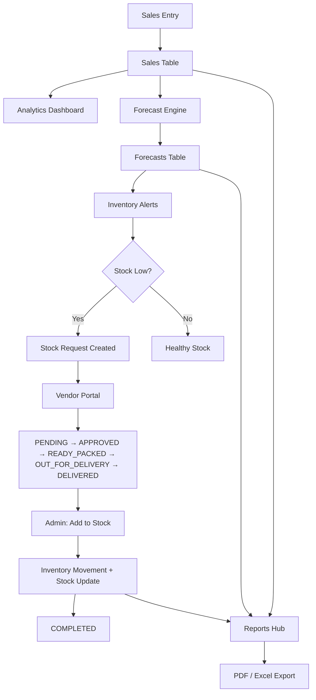
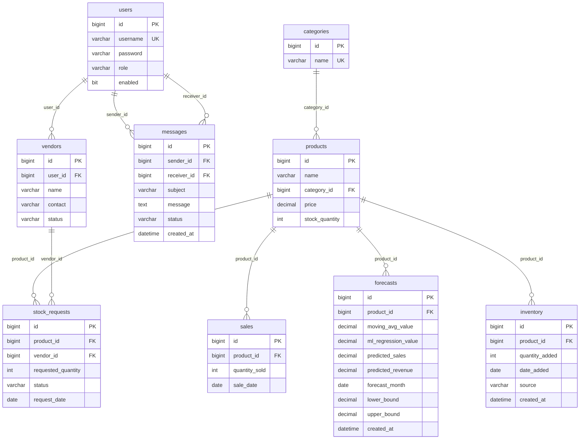
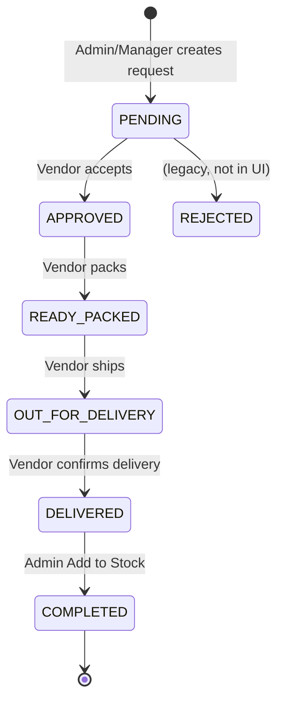

# ForecastPro — Complete Technical Documentation

**Version:** 1.0.0  
**Project:** Sales Analysis and Demand Forecasting System  
**Academic context:** MSc IT Final Year Project  
**Document type:** Technical design document, architecture reference, viva guide, developer handbook  
**Last updated:** June 2026  

---

## Table of Contents

1. [Project Overview](#section-1-project-overview)
2. [Technology Stack](#section-2-technology-stack)
3. [Project Structure](#section-3-project-structure)
4. [Database Design](#section-4-database-design)
5. [Security Architecture](#section-5-security-architecture)
6. [Every Page — Complete UI Reference](#section-6-every-page--complete-ui-reference)
7. [Forecasting Engine](#section-7-forecasting-engine)
8. [Analytics Module](#section-8-analytics-module)
9. [Reports Module](#section-9-reports-module)
10. [Inventory Module](#section-10-inventory-module)
11. [Stock Requests & Vendor Workflow](#section-11-stock-requests--vendor-workflow)
12. [REST API](#section-12-rest-api)
13. [Application Startup & Background Jobs](#section-13-application-startup--background-jobs)
14. [Complete SQL & Query Catalog](#section-14-complete-sql--query-catalog)
15. [Viva Questions (50+)](#section-15-viva-questions-50)
16. [Resume & Application Descriptions](#section-16-resume--application-descriptions)
17. [Additional Systems](#section-17-additional-systems-not-in-original-outline)
18. [Deployment & Operations](#section-18-deployment--operations)

---

# Section 1: Project Overview

## 1.1 What is ForecastPro?

**ForecastPro** is a production-ready **Enterprise Java web application** for a single retail brand. It combines:

- **Sales analytics** — historical revenue, category/product performance, trends
- **Demand forecasting** — ensemble ML (moving average + linear regression) for next-month unit and revenue predictions
- **Inventory intelligence** — low-stock alerts, restock recommendations, movement history
- **Vendor supply chain** — stock requests, vendor portal, warehouse receipt
- **Reporting** — filtered PDF/Excel exports, charts, KPI dashboards
- **Internal messaging** — admin, employee, and vendor communication

**Context root:** `/forecastpro` (Payara deployment)  
**Currency:** Indian Rupee (₹)  
**Business timezone:** `Asia/Kolkata`

## 1.2 Problem Statement

Retail businesses must answer:

| Question | Without ForecastPro | With ForecastPro |
|----------|---------------------|------------------|
| What sold well last month? | Manual spreadsheets | Automated analytics dashboards |
| How much will we sell next month? | Guesswork | Statistical + ML ensemble forecast |
| Do we have enough stock? | Reactive stock-outs | Proactive alerts vs forecast + thresholds |
| How do we reorder from suppliers? | Phone/email chaos | Structured stock request workflow |
| Can management trust the numbers? | Ad-hoc reports | Exportable PDF/Excel with audit trail |

## 1.3 Industry Use Case

A mid-size furniture and electronics retailer operates three product categories across 15 SKUs. Store employees record daily sales. Sales managers analyse trends and generate monthly forecasts. When forecasted demand exceeds on-hand stock, the system recommends restock quantities. Admins raise **stock requests** to linked **vendors** who fulfil through a tracked status pipeline (Accept → Pack → Deliver). Upon warehouse receipt, inventory is updated automatically.

## 1.4 Why Forecasting Matters

Demand forecasting reduces:

- **Stock-outs** — lost revenue when popular items are unavailable
- **Overstock** — capital tied in slow-moving inventory
- **Emergency purchases** — premium freight for rush orders

ForecastPro uses an **explainable** ensemble (not a black-box deep learning model), suitable for academic demonstration and business transparency.

## 1.5 Why Inventory Matters

Inventory is the bridge between **predicted demand** and **physical availability**. ForecastPro compares:

```
current_stock < predicted_demand  OR  current_stock < minimum_threshold  →  ALERT
```

## 1.6 Why Vendor Management Matters

Vendors are external fulfilment partners. Linking `vendors.user_id` to login accounts enables a **dedicated vendor portal** where suppliers see only their requests and messages — separation of concerns from internal staff.

## 1.7 User Roles & Responsibilities

| Role | Enum | Primary Responsibilities |
|------|------|--------------------------|
| **Administrator** | `ADMIN` | User management, categories, vendors, stock receipt (`Add to Stock`), full system access |
| **Sales Manager** | `SALES_MANAGER` | Analytics, forecasting, reports, inventory alerts, stock request creation |
| **Employee** | `EMPLOYEE` | Product catalogue maintenance, sales entry, sales reports, messages to admin |
| **Vendor** | `VENDOR` | Vendor portal only: fulfil stock requests, message admin |

## 1.8 End-to-End Business Workflow



### Step-by-step narrative

1. **Sales** — Employee records `quantity_sold` per product per `sale_date`. `SaleService` decrements `products.stock_quantity`.
2. **Analytics** — `AnalyticsService` aggregates revenue by month, category, product via native SQL.
3. **Forecast** — `ForecastService` reads monthly quantity series, computes MA + regression ensemble, stores in `forecasts`.
4. **Inventory Alerts** — `AlertService` compares stock vs latest forecast and per-product minimum thresholds.
5. **Stock Request** — Admin/Manager creates request with vendor assignment; status = `PENDING`.
6. **Vendor** — Vendor accepts and progresses delivery statuses in `/vendor/requests.xhtml`.
7. **Inventory Update** — Admin clicks **Add to Stock** on `DELIVERED` requests; stock increases, `inventory` row created, status → `COMPLETED`.
8. **Reports** — Managers export filtered sales, forecast, inventory, seasonality reports.

---

# Section 2: Technology Stack

## 2.1 Core Platform

| Technology | Version | Why Chosen | Alternatives | Classes Using It |
|------------|---------|------------|--------------|------------------|
| **Java** | 17 | LTS, records, modern language features; university/industry standard | Java 11, 21 | All `src/main/java/**` |
| **Maven** | 3.x | Standard Java build, dependency management, WAR packaging | Gradle | `pom.xml` |
| **Payara Server** | 6.x | Full Jakarta EE 10 runtime (EJB, CDI, JPA, JAX-RS) | WildFly, GlassFish, TomEE | Deployment target |
| **Jakarta EE** | 10.0.0 | Specification for enterprise: EJB, CDI, JPA, Servlet, JAX-RS, JSF | Spring Boot (different paradigm) | `jakarta.*` imports throughout |

## 2.2 Presentation Layer

| Technology | Version | Why Chosen | Alternatives | Usage |
|------------|---------|------------|--------------|-------|
| **JSF (Jakarta Faces)** | 4.0 | Server-side component model, Facelets templates, university EE curriculum | Thymeleaf, Vaadin | All `.xhtml` pages |
| **PrimeFaces** | 13.0.5 | Rich components: DataTable, charts, dialogs, growl, AJAX | RichFaces (deprecated) | `p:*` components, `ChartModel` |
| **CDI** | 4.0 | `@Inject`, `@Named`, `@SessionScoped`, `@ViewScoped` beans | Spring DI | All controllers, services |
| **Facelets** | — | Template composition (`ui:composition`, `ui:define`) | JSP | `main.xhtml`, `vendor-main.xhtml` |

## 2.3 Business & Persistence Layer

| Technology | Why Chosen | Alternatives | Usage |
|------------|------------|--------------|-------|
| **EJB (@Stateless)** | Transaction boundaries, container-managed pooling | Spring `@Service` | All `*Service.java`, `*Repository.java` |
| **JPA (EclipseLink)** | ORM mapping entities to MySQL; provided by Payara | Hibernate as provider | All `entity/*`, `persistence.xml` |
| **MySQL** | Relational data, aggregations, academic familiarity | PostgreSQL, Oracle | `jdbc/ForecastProDS` |

## 2.4 Libraries

| Library | Version | Why Chosen | Alternatives | Classes |
|---------|---------|------------|--------------|---------|
| **Apache Commons Math3** | 3.6.1 | `SimpleRegression`, `StandardDeviation` — proven statistical algorithms | Smile, Weka (heavier) | `ForecastService` |
| **jBCrypt** | 0.4 | Industry-standard password hashing | Argon2, PBKDF2 | `PasswordUtil`, `AuthService` |
| **OpenPDF** | 2.0.3 | PDF generation for reports (LGPL fork of iText 4) | iText 7 (commercial), Flying Saucer | `ReportsBean` (`com.lowagie.text.*`) |
| **Apache POI** | 5.4.1 | Excel `.xlsx` export | JExcelAPI | `ReportsBean` (`XSSFWorkbook`) |
| **JAX-RS** | Jakarta EE | REST JSON API for integration demos | Spring WebFlux | `ForecastResource`, `ProductResource` |

## 2.5 Architecture Pattern

```
┌─────────────────────────────────────────────────────────┐
│  XHTML (View) + PrimeFaces Components                   │
├─────────────────────────────────────────────────────────┤
│  JSF Managed Beans (@Named, @ViewScoped/@SessionScoped) │
├─────────────────────────────────────────────────────────┤
│  EJB Services (@Stateless) — Business Logic + Security  │
├─────────────────────────────────────────────────────────┤
│  Repositories (@Stateless) — JPQL + Native SQL            │
├─────────────────────────────────────────────────────────┤
│  JPA Entities + DTOs                                    │
├─────────────────────────────────────────────────────────┤
│  MySQL Database                                         │
└─────────────────────────────────────────────────────────┘

Cross-cutting: SecurityFilter, ForecastExceptionHandler, Startup Singletons
```

---

# Section 3: Project Structure

```
ForecastPro/
├── pom.xml                          # Maven build + dependencies
├── docs/                            # Documentation (this file)
├── scripts/db/                      # SQL schema, seeds, migrations
└── src/main/
    ├── java/com/forecastpro/
    │   ├── config/                  # Filters, startup, scheduler, JAX-RS app
    │   ├── controller/              # JSF managed beans (20 classes)
    │   ├── dto/                     # Data transfer objects (14 classes)
    │   ├── entity/                  # JPA entities + enums (12 classes)
    │   ├── ml/                      # Moving average forecaster
    │   ├── repository/              # Data access (9 classes)
    │   ├── rest/                    # JAX-RS resources (2 classes)
    │   ├── service/                 # Business logic (19 classes)
    │   └── util/                    # Password, validation, formatting
    ├── resources/META-INF/
    │   └── persistence.xml          # JPA unit ForecastProPU
    └── webapp/
        ├── login.xhtml, error.xhtml, access-denied.xhtml
        ├── app/                     # Internal application pages
        ├── vendor/                  # Vendor portal pages
        ├── resources/css/app.css    # Custom stylesheet (~953 lines)
        └── WEB-INF/
            ├── web.xml, faces-config.xml, beans.xml
            └── template/            # main.xhtml, vendor-main.xhtml
```

## 3.1 `controller/` — JSF Managed Beans

| File | Scope | Purpose |
|------|-------|---------|
| `UserSessionBean` | Session | Holds logged-in `User`; role helpers; logout |
| `LoginBean` | View | Authentication form |
| `DashboardBean` | View | Dashboard KPI metrics |
| `AnalyticsBean` | View | Sales analytics charts + tables |
| `DemandForecastBean` | View | Per-product demand forecast UI |
| `SalesForecastBean` | View | Revenue-focused forecast UI |
| `ForecastRedirectBean` | Request | Redirect `/forecast/forecast.xhtml` → demand |
| `ReportsBean` | View | Reports hub, filters, charts, PDF/Excel export |
| `InventoryBean` | View | Recommendations, alerts, movement history |
| `AlertBean` | View | Redirect to inventory alerts section |
| `StockRequestBean` | View | Create/manage stock requests |
| `VendorBean` | View | Admin vendor CRUD |
| `VendorDashboardBean` | View | Vendor KPI cards |
| `VendorRequestsBean` | View | Vendor fulfilment actions |
| `SaleBean` | View | Record new sales |
| `SalesReportBean` | View | Monthly/yearly sales tables |
| `ProductBean` | View | Product CRUD |
| `CategoryBean` | View | Category CRUD |
| `UserManagementBean` | View | User CRUD (admin) |
| `MessageBean` | View | Messaging inbox + compose |

## 3.2 `service/` — EJB Business Layer

| Service | Responsibility |
|---------|----------------|
| `AuthService` | Username/password authentication |
| `SecurityService` | Role-based access checks (throws `AccessDeniedException`) |
| `UserService` | User CRUD |
| `CategoryService` | Category CRUD |
| `ProductService` | Product CRUD, list by category |
| `SaleService` | Record sale, decrement stock |
| `AnalyticsService` | Revenue aggregations, top/low products |
| `ForecastService` | **Core forecasting engine** |
| `SeasonalityService` | Best/worst month analysis |
| `SalesReportService` | Monthly/yearly sales report rows |
| `DashboardService` | Dashboard aggregate counts |
| `AlertService` | Inventory recommendations + alerts |
| `InventoryService` | Inventory movement constants |
| `InventoryThresholds` | Per-product minimum stock levels |
| `StockRequestService` | Stock request lifecycle |
| `VendorService` | Vendor CRUD + lookup by user |
| `MessageService` | Send/list/close messages |
| `EmailService` | SMTP inventory alert emails |
| `DataSeedService` | Idempotent demo data on empty DB |
| `SalesReportService` | Filtered sales report data |

## 3.3 `repository/` — Data Access

All `@Stateless` with `@PersistenceContext(unitName = "ForecastProPU")`. See [Section 14](#section-14-complete-sql--query-catalog) for every query.

## 3.4 `entity/` — JPA Domain Model

Maps to MySQL tables. Relationships use `@ManyToOne`, `@OneToMany`. Enums stored as `STRING`.

## 3.5 `dto/` — Transfer Objects

Plain Java beans for charts, tables, REST JSON, KPI cards — decouple UI from entities.

## 3.6 `config/` — Infrastructure

| Class | Type | Purpose |
|-------|------|---------|
| `SecurityFilter` | Servlet Filter | URL-based role guards |
| `JaxRsApplication` | JAX-RS `@ApplicationPath("/api")` | Registers REST resources |
| `ForecastExceptionHandler` | JSF | Maps exceptions to FacesMessages |
| `ForecastExceptionHandlerFactory` | JSF | Factory for custom handler |
| `ForecastTableMigrationStartup` | `@Singleton @Startup` | DDL migration for forecast columns |
| `DataSeedStartup` | `@Singleton @Startup` | Seeds demo data if empty |
| `ForecastScheduler` | `@Singleton @Startup` | Monthly auto-forecast cron |
| `HealthServlet` | Servlet `/health` | Deployment health check |
| `BusinessException` | Exception | Validation/business errors |
| `AccessDeniedException` | Exception | Authorization failures |

## 3.7 `ml/` — Machine Learning

`MovingAverageForecaster` — simple moving average over last N months.

## 3.8 `util/` — Utilities

| Class | Methods |
|-------|---------|
| `PasswordUtil` | BCrypt hash/match |
| `ValidationUtil` | `requireNonBlank`, `requirePositive`, etc. |
| `DisplayFormats` | Date/time formatting (`dd/MM/yyyy`) |

## 3.9 `scripts/db/` — SQL Scripts

| File | Purpose |
|------|---------|
| `schema.sql` | Core tables: users, categories, products, sales, forecasts |
| `seed-all.sql` | Small demo dataset |
| `seed-large.sql` | Full demo: 18 months sales, vendors, messages, inventory |
| `seed-users.sql` | Users only |
| `generate-seed-large.py` | Python generator for `seed-large.sql` |
| `alter-forecasts-*.sql` | Manual migration scripts |

## 3.10 `webapp/` — Presentation

32 XHTML files. Templates in `WEB-INF/template/`. Single CSS: `resources/css/app.css`. No custom JavaScript files.

---

# Section 4: Database Design

## 4.1 Entity-Relationship Diagram



## 4.2 Table Reference

### `users`

| Column | Type | Constraints | Description |
|--------|------|-------------|-------------|
| `id` | BIGINT | PK, AUTO_INCREMENT | Surrogate key |
| `username` | VARCHAR(64) | NOT NULL, UNIQUE | Login name |
| `password` | VARCHAR(255) | NOT NULL | BCrypt hash |
| `role` | VARCHAR(32) | NOT NULL | ADMIN, SALES_MANAGER, EMPLOYEE, VENDOR |
| `enabled` | BIT(1) | NOT NULL | Account active flag |

**Example row:** `(1, 'admin', '$2a$10$...', 'ADMIN', 1)`

### `categories`

| Column | Type | Constraints |
|--------|------|-------------|
| `id` | BIGINT | PK |
| `name` | VARCHAR(128) | NOT NULL, UNIQUE |

**Example:** `(1, 'Electronics')`

### `products`

| Column | Type | Constraints |
|--------|------|-------------|
| `id` | BIGINT | PK |
| `name` | VARCHAR(255) | NOT NULL |
| `category_id` | BIGINT | FK → categories |
| `price` | DECIMAL(14,2) | NOT NULL |
| `stock_quantity` | INT | NOT NULL |

**Relationship:** Many products → one category (`@ManyToOne` on Product)

### `sales`

| Column | Type | Constraints |
|--------|------|-------------|
| `id` | BIGINT | PK |
| `product_id` | BIGINT | FK → products |
| `quantity_sold` | INT | NOT NULL |
| `sale_date` | DATE | NOT NULL |

**Indexes:** `idx_sales_product`, `idx_sales_date`

### `forecasts`

| Column | Type | Constraints |
|--------|------|-------------|
| `id` | BIGINT | PK |
| `product_id` | BIGINT | FK → products |
| `moving_avg_value` | DECIMAL(18,4) | NOT NULL |
| `ml_regression_value` | DECIMAL(18,4) | NOT NULL |
| `predicted_sales` | DECIMAL(18,4) | NOT NULL, DEFAULT 0 |
| `predicted_revenue` | DECIMAL(18,4) | NOT NULL, DEFAULT 0 |
| `forecast_month` | DATE | NOT NULL |
| `lower_bound` | DECIMAL(18,4) | NOT NULL, DEFAULT 0 |
| `upper_bound` | DECIMAL(18,4) | NOT NULL, DEFAULT 0 |
| `created_at` | DATETIME(6) | NOT NULL |

**Unique:** `(product_id, forecast_month)` — one forecast per product per month

### `vendors`

| Column | Type | Constraints |
|--------|------|-------------|
| `id` | BIGINT | PK |
| `user_id` | BIGINT | FK → users (VENDOR role) |
| `name` | VARCHAR | NOT NULL |
| `contact` | VARCHAR | Phone/email |
| `status` | VARCHAR | ACTIVE/INACTIVE |

### `inventory`

| Column | Type | Description |
|--------|------|-------------|
| `id` | BIGINT | PK |
| `product_id` | BIGINT | FK |
| `quantity_added` | INT | Units received |
| `date_added` | DATE | Movement date |
| `source` | VARCHAR | e.g. `VENDOR_DELIVERY` |
| `created_at` | DATETIME | Audit timestamp |

### `stock_requests`

| Column | Type | Description |
|--------|------|-------------|
| `id` | BIGINT | PK |
| `product_id` | BIGINT | FK |
| `vendor_id` | BIGINT | FK |
| `requested_quantity` | INT | Units ordered |
| `status` | VARCHAR | Workflow enum |
| `request_date` | DATE | Created date |

### `messages`

| Column | Type | Description |
|--------|------|-------------|
| `id` | BIGINT | PK |
| `sender_id` | BIGINT | FK → users |
| `receiver_id` | BIGINT | FK → users |
| `subject` | VARCHAR | Message subject |
| `message` | TEXT | Body (JPA field: `body`) |
| `status` | VARCHAR | OPEN, CLOSED, RESOLVED |
| `created_at` | DATETIME | Timestamp |

## 4.3 JPA Relationship Summary

| Relationship | JPA Annotation | Example |
|--------------|----------------|---------|
| Product → Category | `@ManyToOne` | Many products in one category |
| Category → Products | `@OneToMany` | One category has many products |
| Sale → Product | `@ManyToOne(EAGER)` | Each sale references one product |
| Forecast → Product | `@ManyToOne` | Each forecast for one product |
| Vendor → User | `@ManyToOne` | Vendor login linked to user account |
| Message → User (sender/recipient) | `@ManyToOne` | Directed messaging |

---

# Section 5: Security Architecture

## 5.1 Components

| Component | File | Responsibility |
|-----------|------|----------------|
| `SecurityFilter` | `config/SecurityFilter.java` | Servlet filter on `/app/*`, `/vendor/*` |
| `SecurityService` | `service/SecurityService.java` | EJB method-level role checks |
| `UserSessionBean` | `controller/UserSessionBean.java` | CDI session holding `currentUser` |
| `LoginBean` | `controller/LoginBean.java` | Login form action |
| `AuthService` | `service/AuthService.java` | Credential verification |
| `PasswordUtil` | `util/PasswordUtil.java` | BCrypt hashing |

## 5.2 Login Flow (Step by Step)

```
1. User opens /login.xhtml (welcome file)
2. Enters username + password → loginBean.login()
3. AuthService.authenticate():
   a. UserRepository.findByUsername(username)
   b. Check user.enabled == true
   c. PasswordUtil.matches(plain, hashed) — BCrypt
4. On success: userSession.setCurrentUser(user)
5. Redirect:
   - VENDOR → /vendor/dashboard.xhtml
   - Others → /app/dashboard.xhtml
6. On failure: FacesMessage error, stay on login page
```

## 5.3 Session Management

- **Scope:** `UserSessionBean` is `@SessionScoped` — lives until logout or 60-minute timeout (`web.xml`)
- **Logout:** `logoutAction()` invalidates HTTP session, redirects to login
- **No server-side session token beyond Jakarta servlet session + CDI bean**

## 5.4 BCrypt Password Hashing

```java
// PasswordUtil.java
BCrypt.hashpw(plain, BCrypt.gensalt(10))  // cost factor 10
BCrypt.checkpw(plain, hashed)             // login verification
```

**Why BCrypt:** Adaptive cost, salt embedded, resistant to rainbow tables.  
**Seed passwords:** `Admin@123`, `Manager@123`, `Employee@123`, `Vendor@123`

## 5.5 URL-Level Access Control (`SecurityFilter`)

| Path | Rule |
|------|------|
| Not logged in | → `/login.xhtml` |
| `/vendor/*` | VENDOR only; others → `/app/dashboard.xhtml` |
| VENDOR on `/app/*` | → `/vendor/dashboard.xhtml` |
| `/app/admin/*` | ADMIN only |
| `/app/analytics/*`, `/app/forecast/*`, `/app/alerts/*` | ADMIN or SALES_MANAGER |
| `/app/products/*`, `/app/sales/*` | ADMIN, EMPLOYEE, or SALES_MANAGER |
| Other `/app/*` | Any authenticated non-VENDOR |

**Note:** `/app/reports/*` passes filter for all non-vendor roles, but `ReportsBean` calls `securityService.requireAdminOrSalesManager()` — employees redirected to `/access-denied.xhtml`.

## 5.6 EJB Method Security

Every service method begins with a `SecurityService` check:

```java
securityService.requireAdmin(caller);           // User management
securityService.requireAdminOrSalesManager(caller);  // Analytics, forecasts
securityService.requireEmployee(caller);        // sendComplaint
securityService.requireAuthenticated(caller);     // General
```

Throws `AccessDeniedException` → caught by `ForecastExceptionHandler` → red FacesMessage.

## 5.7 REST API Security

**Current state:** REST endpoints (`/api/forecasts/recent`, `/api/products`) have **no authentication**. Suitable for demo/integration; production would add JWT or API key filter.

---

# Section 6: Every Page — Complete UI Reference

**Convention:** Route = `{contextPath}` + path (e.g. `/forecastpro/app/dashboard.xhtml`)

## 6.1 Public Pages

### `login.xhtml`

| Attribute | Value |
|-----------|-------|
| **Route** | `/login.xhtml` |
| **Template** | Standalone (no template) |
| **Access** | Public (unauthenticated) |
| **Bean** | `loginBean` |
| **Purpose** | Authenticate users into the system |

| UI Element | Type | Binding / Action |
|------------|------|------------------|
| Username field | `p:inputText` | `#{loginBean.username}` |
| Password field | `p:password` | `#{loginBean.password}` |
| Login button | `p:commandButton` | `action="#{loginBean.login}"`, updates growl |
| Growl | `p:growl` | Shows auth errors |

**Backend:** `LoginBean.login()` → `AuthService.authenticate()` → sets `userSession.currentUser` → redirect by role.

---

### `error.xhtml`

| Attribute | Value |
|-----------|-------|
| **Route** | `/error.xhtml` |
| **Access** | Public |
| **Purpose** | Generic error display via `p:messages` |
| **Action** | Link back to login |

---

### `access-denied.xhtml`

| Attribute | Value |
|-----------|-------|
| **Route** | `/access-denied.xhtml` |
| **Template** | `main.xhtml` |
| **Access** | Authenticated users hitting restricted reports |
| **Purpose** | Static message when `ReportsBean` redirects unauthorized users |

---

## 6.2 Main Application Shell (`WEB-INF/template/main.xhtml`)

| Element | Description |
|---------|-------------|
| Topbar brand | Link to dashboard |
| User label | `#{userSession.currentUser.username}` + role |
| Sign out | `userSession.logoutAction` — invalidates session |
| Sidebar menu | Dashboard, Users, Categories, Products, Sales entry, Reports, Messages |
| Growl | Global notifications |
| Content slot | `ui:insert name="content"` |

**Beans:** `userSession` only in template.

---

## 6.3 `app/dashboard.xhtml`

| Attribute | Value |
|-----------|-------|
| **Route** | `/app/dashboard.xhtml` |
| **Access** | All non-VENDOR roles |
| **Beans** | `dashboardBean`, `userSession` |
| **Init** | `f:viewAction` → `dashboardBean.refresh` |

### Metric Cards

| Card | Bean Property | Source Service |
|------|---------------|----------------|
| Total revenue | `dashboardBean.totalRevenue` | `DashboardService` / `SaleRepository.sumTotalRevenue` |
| Sales count | `dashboardBean.salesCount` | `SaleRepository.countSales` |
| Forecasts | `dashboardBean.forecastCount` | `ForecastRepository.countAll` |
| Low stock | `dashboardBean.lowStockCount` | `ProductRepository.findLowStock` |
| Alerts | `dashboardBean.alertCount` | `AlertService.inventoryAlerts` |

### Shortcut Tiles (conditional by role)

| Tile | Visible When | Link |
|------|--------------|------|
| Analytics | `dashboardBean.showAnalytics` | `/app/analytics/analytics.xhtml` |
| Demand Forecast | Admin/Manager | `/app/forecast/demand.xhtml` |
| Sales Forecast | Admin/Manager | `/app/forecast/sales.xhtml` |
| Inventory | Admin/Manager | `/app/inventory/inventory.xhtml` |
| Vendors | Admin/Manager | `/app/vendors/vendors.xhtml` |
| Stock Requests | Admin/Manager | `/app/stock-requests/stock-requests.xhtml` |

---

## 6.4 `app/analytics/analytics.xhtml`

| Attribute | Value |
|-----------|-------|
| **Route** | `/app/analytics/analytics.xhtml` |
| **Access** | ADMIN, SALES_MANAGER |
| **Bean** | `analyticsBean` |
| **Init** | `@PostConstruct init()` |

### Toolbar

| Control | Action | AJAX Update Targets |
|---------|--------|---------------------|
| **Refresh** | `analyticsBean.refresh` | `monthlySalesTable`, `categoryTable`, `topSellingTable`, `lowSellingTable`, `productWiseTable`, `analyticsMetrics`, `analyticsCharts` |

### KPI Metrics (`analyticsMetrics`)

| Metric | Property | Backend |
|--------|----------|---------|
| Total revenue | `totalRevenue` | `AnalyticsService.totalRevenue` → `SaleRepository.sumTotalRevenue` |
| Total predicted revenue (next month) | `totalPredictedRevenue` | `AnalyticsService.totalNextMonthPredictedRevenueAllProducts` → computes live via `ForecastService.computeNextMonthForecast` per product |
| Next forecast month label | `nextForecastMonth` | `YearMonth.now(Asia/Kolkata).plusMonths(1)` |

### Charts (`analyticsCharts`)

| Chart | Type | Model Property | Data Source | Why This Type |
|-------|------|----------------|-------------|---------------|
| Monthly revenue | **Line** (`p:lineChart`) | `monthlyLineModel` | `List<MonthlySalesRow>` from `monthlySummary` | Shows time-series trend |
| Revenue by category | **Bar** (`p:barChart`) | `categoryBarModel` | `categoryWise` | Compare discrete categories |
| Top products (revenue) | **Bar** | `topProductsBarModel` | `topSelling(limit=100)` | Rank products side-by-side |

**Chart building:** `AnalyticsBean.buildCharts()` creates PrimeFaces `LineChartModel` / `BarChartModel` with `ChartData`, labels from DTO fields, values as `double`.

### Tables (all: `paginator=true`, `rows=10`, `lazy=false`)

| Table ID | Header | Data | Columns |
|----------|--------|------|---------|
| `monthlySalesTable` | Monthly sales | `analyticsBean.monthly` | Month (`m.label`), Revenue (₹) |
| `categoryTable` | Category-wise revenue | `categoryWise` | Category, Revenue |
| `topSellingTable` | Top selling products | `topSelling` | Product, Revenue |
| `lowSellingTable` | Low selling products | `lowSelling` | Product, Revenue |
| `productWiseTable` | Product-wise revenue | `productWise` | Product, Revenue, Quantity sold |

**DTOs:** `MonthlySalesRow`, `CategorySalesRow`, `ProductSalesRow`  
**Repository queries:** Native SQL in `SaleRepository` (monthly, category, product, top, low aggregations)

---

## 6.5–6.20 Additional Pages

### 6.5 `app/forecast/demand.xhtml` (Demand Forecast)

| Attribute | Value |
|-----------|-------|
| **Route** | `/app/forecast/demand.xhtml` |
| **Bean** | `demandForecastBean` (`@ViewScoped`) |
| **Services** | `ForecastService`, `CategoryService`, `ProductService` |
| **Init** | `@PostConstruct` → `loadCategories()`, `loadRecentForecasts()` |

**KPI Cards** (`forecastKpis` from `ForecastService.computeDashboardKpis`):

| KPI | Property |
|-----|----------|
| Forecasted revenue | `forecastedRevenue` |
| Total predicted units | `totalPredictedUnits` |
| Highest predicted product | `highestPredictedProduct` |
| Lowest predicted product | `lowestPredictedProduct` |
| Forecast growth % | `forecastGrowthPercent` |

**Form controls:**

| Control | Property | AJAX |
|---------|----------|------|
| Category | `selectedCategoryId` | `p:ajax listener="#{demandForecastBean.loadProducts}"` |
| Product | `selectedProductId` | — |
| **Generate** | `action="#{demandForecastBean.generate}"` | Full form post → `ForecastService.generateForecast` |

**Latest result panel** (`lastForecast`): moving avg, regression, predicted units, predicted revenue, lower/upper bounds, forecast month.

**Charts:**

| Chart | Model | Type | Data |
|-------|-------|------|------|
| Demand vs historical | `lineModel` | Line | Historical monthly qty + predicted point |
| Product-wise demand | `barModel1` | Bar | Recent forecasts by product |

**History table:** `recentForecasts` — paginated, columns: Product, Month, MA, Regression, Predicted units, Revenue, Bounds.

---

### 6.6 `app/forecast/sales.xhtml` (Sales / Revenue Forecast)

Same structure as demand page plus:

| Unique Element | Description |
|----------------|-------------|
| `topPredictedRevenue` | `List<PredictedRevenueRow>` from `AnalyticsService.topPredictedRevenueProducts` |
| `barModel2` | Bar chart of top predicted revenue products |
| `getDisplayUnitPrice()` | Shows selected product unit price for revenue context |

---

### 6.7 `app/inventory/inventory.xhtml`

**Bean:** `inventoryBean` → `AlertService`, `InventoryService`

| Section | ID | Data Property | Columns |
|---------|-----|---------------|---------|
| Recommendations | — | `inventoryRecommendations` | Product, Category, Stock, Forecast, Min threshold, Purchase qty, Status badge, Smart recommendation |
| Alerts | `#inventory-alerts` | `inventoryAlerts` | Product, Category, Stock, Forecast demand, Recommended restock |
| Movement history | — | `history` | Date, Product, Qty added, Source |

**Request stock link:** `h:link` → `/app/stock-requests/stock-requests.xhtml?productId={id}&qty={recommended}`

**Badge CSS classes:** `inv-badge-healthy`, `inv-badge-restock`, `inv-badge-critical`, `inv-badge-urgent`, `inv-badge-reduce`

---

### 6.8 `app/reports/_report-overview.xhtml` (Partial)

Included by reports hub. Not a standalone route.

| Element | Condition | Data |
|---------|-----------|------|
| Forecast KPI row | `selectedReport eq 'ALL' or 'FORECAST'` | `forecastKpis` |
| Revenue KPI | Always on hub | `kpiRevenue` |
| Units KPI | Always on hub | `kpiUnits` |
| Line chart | Hub | `lineModel` — monthly revenue trend |
| Bar chart | Hub | `barModel` — product revenue |
| Pie chart | Hub | `pieModel` — category distribution |

---

### 6.9 `app/reports/_report-detail.xhtml` (Partial)

Shared by all 6 report detail pages.

**Filter panel components:**

| Component | Binding | Notes |
|-----------|---------|-------|
| `p:selectOneButton` time mode | `timeMode` | MONTHLY / YEARLY / RANGE |
| Year dropdown | `selectedYear` | `yearOptions` (current−10 to current+1) |
| Month dropdown | `selectedMonth` | 1–12, visible in MONTHLY mode |
| From date | `fromDate` | `p:datePicker`, RANGE mode |
| To date | `toDate` | `p:datePicker`, RANGE mode |
| Category | `selectedCategoryId` | `onCategoryChange` clears product |
| Product | `selectedProductId` | Filtered by category |
| Range label | `rangeDisplay` | Formatted date range string |

**Export buttons:** `exportCurrentPdf`, `exportCurrentExcel` — dispatch by `selectedReport`.

**Report-specific tables** (rendered via `reportShows('CODE')`):

| Code | Table | Row Type |
|------|-------|----------|
| SALES | Monthly sales | `MonthlyProductSalesRow` |
| FORECAST | Forecast detail | `Forecast` entity |
| INVENTORY | Movements | `InventoryMovement` |
| PRODUCT_PERFORMANCE | Product perf | `ProductSalesRow` |
| CATEGORY | Category revenue | `CategorySalesRow` |
| SEASONALITY | Seasonality | `SeasonalityRow` |

**Forecast table columns:** Product, Forecast month, Predicted units, Predicted revenue (₹), Moving avg, Regression, Lower bound, Upper bound.

**Seasonality columns:** Product, Best month, Worst month, Avg monthly sales, Seasonality strength %.

---

### 6.10 `app/stock-requests/stock-requests.xhtml`

**Bean:** `stockRequestBean`

**New request form** (Admin/Manager):

| Field | Property |
|-------|----------|
| Product | `formProductId` — `f:selectItems` from products |
| Vendor | `formVendorId` — active vendors |
| Quantity | `formQuantity` |
| **Submit** | `create()` → `StockRequestService.create` |

**Table columns:** Product, Vendor, Quantity, Status (CSS class via `statusStyleClass`), Date, Actions.

**Vendor action buttons** (rendered per current status):

| Button | From Status | To Status |
|--------|-------------|-----------|
| Accept | PENDING | APPROVED |
| Ready & packed | APPROVED | READY_PACKED |
| Out for delivery | READY_PACKED | OUT_FOR_DELIVERY |
| Delivered | OUT_FOR_DELIVERY | DELIVERED |

**Admin only:** **Add to Stock** when DELIVERED → `addToStock(r)`.

**Query param init:** `@PostConstruct` reads `productId`, `qty` from URL for inventory prefill.

---

### 6.11 `app/products/products.xhtml`

| Field | Property | Validation |
|-------|----------|------------|
| Category | `formCategoryId` | Required |
| Name | `formName` | Required |
| Price | `formPrice` | Required, positive |
| Stock | `formStock` | Non-negative int |

**Service:** `ProductService.save/delete` with role check.

---

### 6.12 `app/admin/users.xhtml`

| Field | Property |
|-------|----------|
| Username | `formUsername` |
| Password | `formPassword` (required on create) |
| Role | `formRole` — ADMIN, SALES_MANAGER, EMPLOYEE, VENDOR |
| Enabled | `formEnabled` |

**Dialog:** `p:dialog id="editDlg"` — Edit loads `prepareEdit(u)`, Save calls `saveEdit()`.

---

### 6.13 `app/admin/categories.xhtml`

Inline add form + table. Edit opens `catDlg` dialog. Delete with `onclick="return confirm('Delete category?');"`.

**Service:** `CategoryService` — cannot delete if products exist (BusinessException).

---

### 6.14 `app/sales/sales.xhtml`

| Field | Property |
|-------|----------|
| Category | `selectedCategoryId` → `loadProducts` |
| Product | `selectedProductId` |
| Quantity | `quantity` |
| Sale date | `saleDate` (default today) |

**Save sale:** `SaleService.recordSale` — validates stock ≥ quantity, decrements `products.stock_quantity`, inserts `sales` row.

---

### 6.15 `app/sales/sales-report.xhtml`

**Bean:** `salesReportBean`  
**Tabs:** Monthly (`monthlyRows`), Yearly (`yearlyRows`)  
**Filters:** Category, Product, Refresh  
**Note:** Not linked from sidebar — direct URL access only.

---

### 6.16–6.18 Vendor Portal Pages

**`vendor/dashboard.xhtml`:** 5 metric cards from `VendorDashboardBean` → `StockRequestService.summarizeVendorRequests`. Links to requests + messages.

**`vendor/requests.xhtml`:** Same workflow buttons as stock-requests but vendor-scoped via `vendorRequestsBean`. Growl on status update errors.

**`vendor/messages.xhtml`:** Compose panel (Subject, Message) → `messageBean.sendToAdmin`. Table identical to app messages inbox.

---

### 6.19 Complete Page Index

| # | Route | Bean(s) | Access |
|---|-------|---------|--------|
| 1 | `/login.xhtml` | `loginBean` | Public |
| 2 | `/error.xhtml` | — | Public |
| 3 | `/access-denied.xhtml` | — | Authenticated |
| 4 | `/app/dashboard.xhtml` | `dashboardBean` | Non-vendor |
| 5 | `/app/analytics/analytics.xhtml` | `analyticsBean` | Admin/Manager |
| 6 | `/app/forecast/demand.xhtml` | `demandForecastBean` | Admin/Manager |
| 7 | `/app/forecast/sales.xhtml` | `salesForecastBean` | Admin/Manager |
| 8 | `/app/forecast/forecast.xhtml` | `forecastRedirectBean` | Redirect |
| 9 | `/app/inventory/inventory.xhtml` | `inventoryBean` | Admin/Manager |
| 10 | `/app/alerts/alerts.xhtml` | `alertBean` | Redirect |
| 11 | `/app/messages/messages.xhtml` | `messageBean` | Non-vendor |
| 12 | `/app/reports/reports.xhtml` | `reportsBean` | Admin/Manager |
| 13–18 | `/app/reports/*-report.xhtml` | `reportsBean` | Admin/Manager |
| 19 | `/app/sales/sales.xhtml` | `saleBean` | Admin/Employee/Manager |
| 20 | `/app/sales/sales-report.xhtml` | `salesReportBean` | Admin/Employee/Manager |
| 21 | `/app/products/products.xhtml` | `productBean` | Admin/Employee/Manager |
| 22 | `/app/admin/categories.xhtml` | `categoryBean` | Admin |
| 23 | `/app/admin/users.xhtml` | `userManagementBean` | Admin |
| 24 | `/app/vendors/vendors.xhtml` | `vendorBean` | Non-vendor |
| 25 | `/app/stock-requests/stock-requests.xhtml` | `stockRequestBean` | Admin/Manager (+vendor actions) |
| 26 | `/vendor/dashboard.xhtml` | `vendorDashboardBean` | Vendor |
| 27 | `/vendor/requests.xhtml` | `vendorRequestsBean` | Vendor |
| 28 | `/vendor/messages.xhtml` | `messageBean` | Vendor |

**Partials (not routes):** `_report-overview.xhtml`, `_report-detail.xhtml`  
**Templates:** `main.xhtml`, `vendor-main.xhtml`

---

# Section 7: Forecasting Engine

## 7.1 Architecture

```
DemandForecastBean / SalesForecastBean
        ↓
ForecastService (@Stateless EJB)
        ↓
├── SaleRepository.monthlyQuantityByProductNative(productId)
├── MovingAverageForecaster.forecast(series, window=3)
├── SimpleRegression (Apache Commons Math)
├── StandardDeviation (confidence bounds)
        ↓
ForecastRepository.save(Forecast)
```

## 7.2 Step-by-Step Algorithm

### Step 1: Fetch Sales History

**Method:** `ForecastService.loadMonthlyQuantitySeries(productId)`

**SQL (native):**
```sql
SELECT YEAR(s.sale_date), MONTH(s.sale_date), SUM(s.quantity_sold)
FROM sales s WHERE s.product_id = ?
GROUP BY YEAR(s.sale_date), MONTH(s.sale_date)
ORDER BY YEAR(s.sale_date), MONTH(s.sale_date)
```

**Result:** Ordered `List<BigDecimal>` of monthly unit totals (chronological).

### Step 2: Moving Average (Window = 3)

**Class:** `MovingAverageForecaster.forecast(monthlyTotals, 3)`

**Formula:**

\[
MA = \frac{1}{w} \sum_{i=n-w+1}^{n} Q_i
\]

Where \(w = 3\) (or fewer months if history < 3), \(Q_i\) = quantity in month \(i\).

**Example:** Monthly quantities = [10, 12, 15, 18]  
MA = (12 + 15 + 18) / 3 = **15.0**

### Step 3: Linear Regression

**Class:** `org.apache.commons.math3.stat.regression.SimpleRegression`

**Model:** \(y = mx + c\)

| Symbol | Meaning |
|--------|---------|
| \(x\) | Month index (0, 1, 2, …, n−1) |
| \(y\) | Monthly quantity sold |
| \(m\) | Slope — average change in sales per month |
| \(c\) | Intercept — baseline sales level |

**Prediction:** `reg.predict(n)` — forecast for next month index \(n\).

If NaN/Infinite (e.g. flat line edge case), fallback to arithmetic mean of all months.

### Step 4: Regression Clamping

**Why:** Raw regression can swing wildly on noisy data. Clamping keeps regression within ±20% of moving average.

\[
clampedReg = \max(0.8 \times MA,\ \min(1.2 \times MA,\ reg))
\]

### Step 5: Weighted Ensemble

**Why 70/30:** Moving average captures recent stable demand; regression captures trend. 70% weight on MA reduces overreaction to outliers.

\[
predictedSales = 0.7 \times MA + 0.3 \times clampedReg
\]

Rounded to 2 decimal places.

### Step 6: Predicted Revenue

\[
predictedRevenue = predictedSales \times product.price
\]

### Step 7: Confidence Interval (Bounds)

**Method:** `StandardDeviation.evaluate(monthlyQuantities)`

\[
lowerBound = \max(0,\ predictedSales - \sigma)
\]
\[
upperBound = predictedSales + \sigma
\]

Where \(\sigma\) = standard deviation of monthly quantities.

### Step 8: Forecast Month

\[
forecastMonth = YearMonth.now(Asia/Kolkata).plusMonths(1).atDay(1)
\]

### Step 9: Persist

Upsert via `ForecastRepository.findByProductAndMonth` — unique constraint `(product_id, forecast_month)`.

## 7.3 Forecast Accuracy

For completed forecast months:

\[
Accuracy\% = \left(1 - \frac{|predicted - actual|}{actual}\right) \times 100
\]

**Aggregate metrics:** MAE, MSE, RMSE, MAPE in `computeAccuracyMetrics()`.

## 7.4 Automatic Generation

`ForecastScheduler` runs `@Schedule(dayOfMonth=1, hour=0, minute=5)` → `generateForecastsForAllProductsAutomatic()`.

---

# Section 8: Analytics Module

| Metric | Service Method | Repository Query |
|--------|----------------|------------------|
| Total revenue | `totalRevenue` | `sumTotalRevenue` (JPQL) |
| Monthly summary | `monthlySummary` | `monthlyRevenueNative` |
| Category-wise | `categoryWise` | `categoryRevenueNative` |
| Product-wise | `productWise` | `productRevenueNative` |
| Top selling | `topSelling(n)` | `topProductsNative` DESC |
| Low selling | `lowSelling(n)` | `lowProductsNative` ASC |
| Top predicted revenue | `topPredictedRevenueProducts` | `latestForecastRevenueRows` |

**Chart pipeline:** DTO list → Bean builds `ChartData` → `LineChartModel`/`BarChartModel` → XHTML `p:lineChart`/`p:barChart`.

---

# Section 9: Reports Module

## 9.1 Report Types & Time Modes

| ReportType | Purpose |
|------------|---------|
| SALES, INVENTORY, FORECAST, PRODUCT_PERFORMANCE, CATEGORY, SEASONALITY, ALL | See hub tiles |

| TimeMode | Range |
|----------|-------|
| MONTHLY | Selected year/month |
| YEARLY | Full calendar year |
| RANGE | Custom from/to dates |

## 9.2 PDF Export (OpenPDF)

`ReportsBean` builds `com.lowagie.text.Document` + `PdfPTable`, streams via `sendPdf(filename, bytes)`.

## 9.3 Excel Export (Apache POI)

`XSSFWorkbook` + sheet rows → `sendExcel(filename, bytes)`.

---

# Section 10: Inventory Module

**Alert condition:** `stock < forecast` OR `stock < InventoryThresholds.minimumFor(product)`

**Statuses:** Healthy, Restock Required, Critical  
**Email:** `EmailService.sendInventoryAlert` on alert (60-min dedup)  
**Movement source:** `VENDOR_DELIVERY` on stock request completion

---

# Section 11: Stock Requests & Vendor Workflow

## 11.1 Status State Machine



## 11.2 Who Does What

| Action | Role | Service Method |
|--------|------|----------------|
| Create request | ADMIN, SALES_MANAGER | `StockRequestService.create` |
| Accept / Pack / Ship / Deliver | VENDOR | `StockRequestService.transitionStatus` |
| Add to Stock | ADMIN | `StockRequestService.addToInventory` |

## 11.3 Automatic Inventory Update

When admin clicks **Add to Stock** on a `DELIVERED` request:

1. `productRepository.adjustStock(productId, requestedQuantity)` — increases `stock_quantity`
2. `InventoryMovement` row created with `source = VENDOR_DELIVERY`
3. Request status → `COMPLETED`

**Classes:** `StockRequestService`, `ProductRepository`, `InventoryMovementRepository`

## 11.4 Vendor Portal Isolation

- `SecurityFilter` restricts `/vendor/*` to `UserRole.VENDOR`
- `StockRequestRepository.findByVendorUserId` scopes data to `vendors.user_id`
- Vendors cannot access `/app/*` pages

## 11.5 Vendor Dashboard KPIs

| KPI | Query |
|-----|-------|
| Total | `countByVendorUserId` |
| Pending | `countByVendorUserIdAndStatus(PENDING)` |
| Active | APPROVED + READY_PACKED + OUT_FOR_DELIVERY |
| Awaiting warehouse | DELIVERED |
| Received | COMPLETED + legacy RECEIVED |

---

# Section 12: REST API

**Base URL:** `{contextPath}/api`  
**Application class:** `JaxRsApplication` (`@ApplicationPath("/api")`)

## 12.1 GET `/api/forecasts/recent`

| Attribute | Value |
|-----------|-------|
| **Resource** | `ForecastResource` |
| **Produces** | `application/json` |
| **Auth** | None |
| **Returns** | 20 most recent forecasts |

**Response DTO:** `ForecastApiDto`

```json
[
  {
    "id": 1,
    "productId": 11,
    "productName": "Laptop",
    "movingAvgValue": 10.5000,
    "mlRegressionValue": 11.2000,
    "predictedSales": 10.71,
    "predictedRevenue": 12840.29,
    "forecastMonth": "01/07/2026",
    "createdAt": "2026-06-15T10:30:00Z",
    "createdAtDisplay": "15/06/2026"
  }
]
```

## 12.2 GET `/api/products`

| Attribute | Value |
|-----------|-------|
| **Resource** | `ProductResource` |
| **Produces** | `application/json` |
| **Auth** | None |

```json
[
  {
    "id": 1,
    "name": "Oak Desk",
    "categoryId": 1,
    "categoryName": "Furniture",
    "price": 1299.00,
    "stockQuantity": 120
  }
]
```

## 12.3 GET `/health`

| Attribute | Value |
|-----------|-------|
| **Servlet** | `HealthServlet` |
| **Response** | Plain text: `ForecastPro OK` |

---

# Section 13: Application Startup & Background Jobs

## 13.1 Startup Sequence

```
Payara deploys forecastpro.war
    ↓
1. ForecastTableMigrationStartup (@Singleton @Startup)
   - ALTER TABLE forecasts ADD predicted_sales, predicted_revenue, lower_bound, upper_bound
   - Drop legacy linear_trend_value if present
   - Backfill zero prediction rows
    ↓
2. DataSeedStartup (@DependsOn ForecastTableMigrationStartup)
   - DataSeedService.seedIfEmpty() if users table count = 0
    ↓
3. ForecastScheduler (@Singleton @Startup)
   - Registers monthly cron: 1st of month, 00:05
    ↓
4. JaxRsApplication registers REST resources
5. SecurityFilter active on /app/* and /vendor/*
```

## 13.2 ForecastTableMigrationStartup

Uses raw JDBC via `jdbc/ForecastProDS` (bean-managed transactions). Checks `INFORMATION_SCHEMA.COLUMNS` before each `ALTER TABLE`.

## 13.3 DataSeedStartup

If seed fails (JDBC misconfigured), logs SEVERE — manual `seed-all.sql` fallback documented in log message.

## 13.4 ForecastScheduler

```java
@Schedule(dayOfMonth = "1", hour = "0", minute = "5", persistent = false)
public void generateMonthlyForecasts()
```

Calls `ForecastService.generateForecastsForAllProductsAutomatic()` — idempotent per `(product_id, forecast_month)`.

## 13.5 HealthServlet

Deployment probe: `GET /forecastpro/health` → `200 ForecastPro OK`

---

# Section 14: Complete SQL & Query Catalog

## 14.1 JPQL Queries

### UserRepository
| Method | JPQL |
|--------|------|
| `findByUsername` | `SELECT u FROM User u WHERE u.username = :u` |
| `findAllOrdered` | `SELECT u FROM User u ORDER BY u.username` |
| `count` | `SELECT COUNT(u) FROM User u` |
| `findAdminAndSalesManagers` | `SELECT u FROM User u WHERE u.enabled = true AND (u.role = :admin OR u.role = :manager) ORDER BY u.username` |

### CategoryRepository
| Method | JPQL |
|--------|------|
| `findAllOrdered` | `SELECT c FROM Category c ORDER BY c.name` |
| `existsNameForOther` | `SELECT COUNT(c) FROM Category c WHERE c.name = :n AND (:id IS NULL OR c.id <> :id)` |

### ProductRepository
| Method | JPQL |
|--------|------|
| `findByCategoryId` | `SELECT p FROM Product p WHERE p.category.id = :cid ORDER BY p.name` |
| `findAllOrdered` | `SELECT p FROM Product p JOIN FETCH p.category c ORDER BY c.name, p.name` |
| `count` | `SELECT COUNT(p) FROM Product p` |
| `findLowStock` | `SELECT p FROM Product p JOIN FETCH p.category WHERE p.stockQuantity <= :t ORDER BY p.stockQuantity` |

### SaleRepository
| Method | JPQL |
|--------|------|
| `sumTotalRevenue` | `SELECT COALESCE(SUM(s.quantitySold * p.price), 0) FROM Sale s JOIN s.product p` |
| `countSales` | `SELECT COUNT(s) FROM Sale s` |

### ForecastRepository
| Method | JPQL |
|--------|------|
| `findLatestForProduct` | `SELECT f FROM Forecast f WHERE f.product.id = :pid ORDER BY f.forecastMonth DESC, f.createdAt DESC` (max 1) |
| `findRecent` | `SELECT f FROM Forecast f ORDER BY f.forecastMonth DESC, f.createdAt DESC` |
| `existsByProductAndMonth` | `SELECT COUNT(f) FROM Forecast f WHERE f.product.id = :pid AND f.forecastMonth = :m` |
| `findByProductAndMonth` | `SELECT f FROM Forecast f WHERE f.product.id = :pid AND f.forecastMonth = :m ORDER BY f.createdAt DESC` |
| `findByFilters` | `SELECT f FROM Forecast f JOIN FETCH f.product p JOIN FETCH p.category c WHERE f.forecastMonth >= :from AND f.forecastMonth <= :to AND (:cid IS NULL OR c.id = :cid) AND (:pid IS NULL OR p.id = :pid) ORDER BY f.forecastMonth DESC, f.createdAt DESC` |
| `deleteByProductId` | `DELETE FROM Forecast f WHERE f.product.id = :pid` |
| `countAll` | `SELECT COUNT(f) FROM Forecast f` |

### MessageRepository
| Method | JPQL |
|--------|------|
| `findAllOrderByCreatedDesc` | `SELECT m FROM Message m JOIN FETCH m.sender LEFT JOIN FETCH m.recipient ORDER BY m.createdAt DESC` |
| `findForUser` | `SELECT m FROM Message m JOIN FETCH m.sender LEFT JOIN FETCH m.recipient WHERE m.sender.id = :uid OR m.recipient.id = :uid ORDER BY m.createdAt DESC` |

### StockRequestRepository
| Method | JPQL |
|--------|------|
| `findByIdFetched` | `SELECT r FROM StockRequest r JOIN FETCH r.product JOIN FETCH r.vendor v LEFT JOIN FETCH v.user WHERE r.id = :id` |
| `findAll` | `SELECT s FROM StockRequest s JOIN FETCH s.product JOIN FETCH s.vendor ORDER BY s.requestDate DESC` |
| `findByVendorUserId` | `SELECT s FROM StockRequest s JOIN FETCH s.product JOIN FETCH s.vendor v WHERE v.user.id = :uid ORDER BY s.requestDate DESC` |
| `countByVendorUserId` | `SELECT COUNT(r) FROM StockRequest r JOIN r.vendor v WHERE v.user.id = :uid` |
| `countByVendorUserIdAndStatus` | `SELECT COUNT(r) FROM StockRequest r JOIN r.vendor v WHERE v.user.id = :uid AND r.status = :st` |

### VendorRepository
| Method | JPQL |
|--------|------|
| `findByUserId` | `SELECT v FROM Vendor v WHERE v.user.id = :uid` |
| `findAllActiveOrdered` | `SELECT v FROM Vendor v WHERE UPPER(v.status) = 'ACTIVE' ORDER BY v.name` |
| `findAll` / `findAllOrdered` | Standard find all / order by name |

### InventoryMovementRepository
| Method | JPQL |
|--------|------|
| `findRecent` | `SELECT i FROM InventoryMovement i JOIN FETCH i.product p JOIN FETCH p.category ORDER BY i.createdAt DESC` |
| `findByFilters` | Filtered by date range, category, product with JOIN FETCH |

## 14.2 Native SQL Queries (SaleRepository)

| Method | Purpose |
|--------|---------|
| `monthlyRevenueNative` | Year, month, SUM(qty×price) grouped |
| `categoryRevenueNative` | Revenue per category |
| `productRevenueNative` | Revenue + qty per product |
| `topProductsNative` | Top by revenue DESC |
| `lowProductsNative` | Bottom by revenue ASC |
| `monthlyQuantityByProductNative` | Monthly qty for one product (forecasting input) |
| `monthlySalesByProductFiltered` | Filtered monthly sales |
| `yearlySalesByProductFiltered` | Yearly aggregation |
| `monthlyRevenueRangeNative` | Revenue in date range |
| `productRevenueRangeNative` | Product revenue in range |
| `categoryRevenueRangeNative` | Category revenue in range |
| `quantitySoldInMonth` | Actual units for forecast accuracy |
| `monthlyAverageUnitsByProduct` | Seasonality analysis |
| `averageMonthlyUnitsForProduct` | Average monthly units |

## 14.3 Native SQL (ForecastRepository)

| Method | Purpose |
|--------|---------|
| `sumPredictedRevenueLatestPerProduct` | Sum of latest forecast revenue per product |
| `latestForecastRevenueRows` | Product name, revenue, month for top-N charts |

## 14.4 Criteria Queries

ForecastPro uses **JPQL and native SQL only** — no JPA Criteria API.

---

# Section 15: Viva Questions (50+)

## Forecasting & ML (1–12)

**Q1: What forecasting methods does ForecastPro use?**  
A: A 3-month moving average and simple linear regression (least squares), combined as a 70/30 weighted ensemble with regression clamped to ±20% of the moving average.

**Q2: Why not use deep learning?**  
A: Limited historical data per SKU, need for explainability in viva/audit, and academic requirement to demonstrate manual ML understanding. Linear models are interpretable.

**Q3: What is the moving average formula?**  
A: Average of the last w monthly quantities: MA = (Q_{n-w+1} + … + Q_n) / w, with w=3.

**Q4: Explain y = mx + c in your project.**  
A: x is month index, y is quantity sold. m is slope (trend direction), c is intercept. `SimpleRegression.predict(n)` forecasts month n.

**Q5: Why clamp regression?**  
A: Prevents extreme regression predictions from dominating when sales are volatile or history is short.

**Q6: How is predicted revenue calculated?**  
A: predictedSales × product.unitPrice, rounded to 2 decimals.

**Q7: What are lower_bound and upper_bound?**  
A: Confidence interval: predictedSales ± σ where σ is standard deviation of monthly sales quantities.

**Q8: What is MAPE?**  
A: Mean Absolute Percentage Error — average of |predicted−actual|/actual × 100 for months where actual > 0.

**Q9: When does automatic forecast run?**  
A: 1st of each month at 00:05 via `ForecastScheduler` EJB timer.

**Q10: How do you avoid duplicate forecasts?**  
A: Unique constraint on (product_id, forecast_month) and `existsByProductAndMonth` check before insert.

**Q11: What library provides SimpleRegression?**  
A: Apache Commons Math3 (`commons-math3`).

**Q12: What happens with no sales history?**  
A: `BusinessException`: "No sales history for this product."

## Jakarta EE & Architecture (13–22)

**Q13: What is the layered architecture?**  
A: XHTML → JSF Beans → EJB Services → Repositories → JPA Entities → MySQL.

**Q14: Why EJB instead of plain CDI services?**  
A: Container-managed transactions, pooling, `@Schedule` for timers, standard Jakarta EE enterprise pattern.

**Q15: Difference between @SessionScoped and @ViewScoped?**  
A: Session lives for entire login; ViewScoped bean lives for one page navigation (destroyed on leave).

**Q16: What is CDI?**  
A: Contexts and Dependency Injection — `@Inject`, `@Named` for bean wiring.

**Q17: How does JSF lifecycle relate to PrimeFaces AJAX?**  
A: Partial lifecycle: Apply Request → Render Response for specified `update` component IDs only.

**Q18: What is Facelets?**  
A: XHTML templating for JSF — `ui:composition`, `ui:define`, `ui:insert`.

**Q19: Why WAR packaging?**  
A: Single deployable unit for Payara; contains classes, resources, webapp.

**Q20: What does persistence.xml configure?**  
A: JTA datasource `jdbc/ForecastProDS`, entity list, `schema-generation=none`.

**Q21: What is JOIN FETCH?**  
A: JPQL eager join in query to load associations in same SQL — prevents LazyInitializationException after EJB transaction ends.

**Q22: Explain @ApplicationException(rollback=false) on BusinessException.**  
A: Business validation errors should not roll back the entire JTA transaction when thrown from EJB.

## JPA & MySQL (23–30)

**Q23: What is the difference between JPQL and native SQL?**  
A: JPQL uses entity names/fields; native SQL uses table/column names. Native used for complex aggregations (YEAR/MONTH grouping).

**Q24: Why EAGER fetch on Sale.product?**  
A: JSF renders product name after EJB method returns — lazy load would fail outside persistence context.

**Q25: How are enums stored?**  
A: `@Enumerated(EnumType.STRING)` — varchar column with enum name.

**Q26: What is the forecasts unique key?**  
A: `(product_id, forecast_month)` — one forecast per product per month.

**Q27: How are passwords stored?**  
A: BCrypt hash in `users.password` — never plain text.

**Q28: What is schema-generation=none?**  
A: JPA does not auto-create tables; schema managed by SQL scripts + startup migration.

**Q29: Explain vendor-user relationship.**  
A: `vendors.user_id` FK to `users.id` where role=VENDOR — enables portal login scoped to vendor.

**Q30: What indexes exist on sales?**  
A: `idx_sales_product`, `idx_sales_date` for aggregation performance.

## Security (31–36)

**Q31: How is authentication implemented?**  
A: `AuthService` + BCrypt + `UserSessionBean` session storage.

**Q32: How is authorization implemented?**  
A: Two layers: `SecurityFilter` (URL) + `SecurityService` (EJB method).

**Q33: Can vendors access analytics?**  
A: No — redirected to `/vendor/dashboard.xhtml` if they hit `/app/*`.

**Q34: Are REST APIs secured?**  
A: Currently no — demonstration endpoints. Production would add JWT/OAuth2 filter.

**Q35: What happens on logout?**  
A: Session invalidated, redirect to login.

**Q36: How long is session timeout?**  
A: 60 minutes (`web.xml` session-config).

## PrimeFaces & UI (37–42)

**Q37: What PrimeFaces theme is used?**  
A: Saga (configured in web.xml).

**Q38: How are charts rendered?**  
A: PrimeFaces 13 chart components backed by Java `ChartModel` objects (Chart.js under the hood).

**Q39: What is p:growl?**  
A: Toast notification overlay for success/error messages.

**Q40: Why lazy=false on DataTables?**  
A: Full dataset loaded server-side; pagination is client-side within loaded list.

**Q41: How does dialog editing work?**  
A: `p:dialog` with `widgetVar`; `PF('editDlg').show()` from Edit button (categories, users).

**Q42: What CSS file customizes the UI?**  
A: `resources/css/app.css` (~953 lines).

## Reports, Inventory, Workflow (43–50)

**Q43: How is PDF generated?**  
A: OpenPDF (`com.lowagie.text`) programmatic table building in `ReportsBean`.

**Q44: How is Excel generated?**  
A: Apache POI `XSSFWorkbook` — binary .xlsx stream to browser.

**Q45: When is inventory alert triggered?**  
A: stock < forecast OR stock < per-product minimum threshold.

**Q46: What happens on Add to Stock?**  
A: Stock increases, inventory movement logged, request → COMPLETED.

**Q47: Can employee access reports?**  
A: No — `ReportsBean` requires Admin or Sales Manager; others see access-denied.

**Q48: What is seasonality strength?**  
A: ((bestMonth − worstMonth) / overallAverage) × 100 — from `SeasonalityService`.

**Q49: How do messages work for vendors?**  
A: `MessageService.sendToAdmin` — vendor messages first admin user; inbox shows sent/received via `findForUser`.

**Q50: What is the business timezone?**  
A: Asia/Kolkata — used for forecast month calculation.

## Bonus Questions (51–55)

**Q51: What is ForecastPro's context root?**  
A: `/forecastpro` (Maven finalName).

**Q52: Name all user roles.**  
A: ADMIN, SALES_MANAGER, EMPLOYEE, VENDOR.

**Q53: What does HealthServlet return?**  
A: Plain text "ForecastPro OK".

**Q54: Why OpenPDF instead of iText 7?**  
A: OpenPDF is LGPL/open-source friendly for academic projects; iText 7 has licensing constraints.

**Q55: How is seed data loaded?**  
A: `DataSeedStartup` on empty DB, or manually `mysql < scripts/db/seed-large.sql`.

---

# Section 16: Resume & Application Descriptions

## 16.1 One Line

ForecastPro — Jakarta EE sales analytics and demand forecasting web app with ML ensemble forecasting, inventory alerts, vendor supply chain, and PDF/Excel reporting.

## 16.2 Three Lines

Built ForecastPro, an enterprise retail analytics platform using Java 17, Jakarta EE 10, JSF/PrimeFaces, EJB, and JPA/MySQL. Implemented ensemble demand forecasting (moving average + linear regression), role-based security, vendor portal, and automated inventory alerts. Delivered REST APIs, scheduled forecast generation, and exportable management reports.

## 16.3 100 Words

ForecastPro is a full-stack Enterprise Java web application for retail sales analysis and demand forecasting. Developed with Java 17, Jakarta EE 10 (EJB, CDI, JPA), JSF, PrimeFaces, and MySQL on Payara Server. The system records sales, aggregates revenue analytics, and predicts next-month demand using a weighted ensemble of 3-month moving average and Apache Commons Math linear regression. Features include inventory alert engine with per-product thresholds, vendor stock-request workflow, internal messaging, role-based access for four user types, JAX-RS JSON APIs, and PDF/Excel report export via OpenPDF and Apache POI. Academic MSc IT final-year project demonstrating production-ready layered architecture.

## 16.4 250 Words

ForecastPro is a production-ready Enterprise Java web application designed for single-brand retail operations, combining sales analytics, statistical demand forecasting, inventory intelligence, and vendor supply chain management. Built as an MSc IT capstone, it demonstrates mastery of Jakarta EE 10 layered architecture: JSF/PrimeFaces presentation, CDI managed beans, stateless EJB services, JPA repositories, and MySQL persistence.

The forecasting engine aggregates monthly sales history per SKU, applies a 3-month moving average and simple linear regression (y = mx + c) via Apache Commons Math, clamps regression to ±20% of the moving average, and produces a 70/30 weighted ensemble prediction with confidence bounds based on historical standard deviation. Forecasts persist with uniqueness per product-month and regenerate automatically on the first of each month via EJB `@Schedule`.

Security uses BCrypt password hashing, servlet filters for URL-level role enforcement, and EJB-level authorization checks. Four roles — Administrator, Sales Manager, Employee, and Vendor — access tailored interfaces including a dedicated vendor portal for stock fulfilment.

Additional capabilities include PrimeFaces interactive charts, seasonality analysis, inventory recommendations with email alerts, stock request state machine (Pending through Completed), internal messaging, REST JSON endpoints, database migration startup, idempotent data seeding, and comprehensive PDF/Excel report export. The project is deployable on Payara Server with Maven, suitable for academic evaluation, technical interviews, and demonstration of enterprise software engineering competence.

## 16.5 ATS-Friendly (Software Engineer)

**ForecastPro | Java, Jakarta EE, MySQL, PrimeFaces**  
- Developed enterprise WAR application with JSF, EJB, JPA, REST (JAX-RS)  
- Implemented demand forecasting using moving average and linear regression (Apache Commons Math)  
- Built role-based security (BCrypt, servlet filters, EJB authorization)  
- Created analytics dashboards with PrimeFaces charts and paginated DataTables  
- Designed MySQL schema with 9 tables, JPQL and native SQL aggregations  
- Automated monthly forecast generation with EJB scheduler  
- Integrated PDF (OpenPDF) and Excel (Apache POI) report export  

## 16.6 Australian Masters Application Version

ForecastPro represents my applied research in retail demand forecasting and enterprise systems design. As postgraduate coursework in Information Technology, I engineered a complete Jakarta EE solution addressing real inventory planning challenges: predicting demand, preventing stock-outs, and coordinating vendor replenishment. The project applies explainable machine learning (ensemble moving average and regression) rather than opaque models, aligning with responsible AI principles valued in Australian higher education. Technical competencies demonstrated include Java 17, Maven, Payara, JPA/EclipseLink, MySQL, statistical libraries, secure multi-role web applications, and RESTful service exposure. The system is documented, deployable, and suitable for demonstration to academic examiners and industry stakeholders.

---

# Section 17: Additional Systems (Discovered)

## 17.1 Email Notification Service

**Class:** `EmailService`  
**Trigger:** `AlertService` when product needs restock  
**Config:** JVM property `-Dforecastpro.mail.smtp.host`  
**Fallback:** Logs email content if SMTP not configured  
**Dedup:** 60-minute window per product to avoid spam

## 17.2 Exception Handling

**ForecastExceptionHandler** maps:
- `BusinessException` → SEVERITY_ERROR FacesMessage (user-friendly)
- `AccessDeniedException` → SEVERITY_ERROR FacesMessage
- Others → generic error message

Registered via `faces-config.xml` → `ForecastExceptionHandlerFactory`.

## 17.3 Seasonality Analysis

**SeasonalityService** computes per product:
- Best calendar month (highest avg units)
- Worst calendar month
- Seasonality strength percentage
Used in Seasonality Report with dedicated chart builders in `ReportsBean.Charts`.

## 17.4 Data Seed Generator

**Script:** `scripts/db/generate-seed-large.py`  
Regenerates `seed-large.sql` with 18 months of patterned sales, vendors, messages, low-stock demo products.

## 17.5 CSS Architecture

Single file `app.css` sections: layout, dashboard, analytics, forecast, inventory badges, stock-request status colors, vendor portal, reports hub, responsive breakpoints.

## 17.6 Orphan Pages

| Page | Note |
|------|------|
| `/app/sales/sales-report.xhtml` | Functional but not in main nav menu |
| `/app/forecast/forecast.xhtml` | Redirect stub to demand |
| `/app/alerts/alerts.xhtml` | Redirect stub to inventory |

## 17.7 Currency & Localization

All monetary displays use ₹ (INR) via `f:convertNumber currencySymbol="₹"`. Dates formatted `dd/MM/yyyy` via `DisplayFormats`.

---

# Section 18: Deployment & Operations

## 18.1 Prerequisites

- Java 17 JDK
- Maven 3.8+
- Payara Server 6+
- MySQL 8+

## 18.2 Database Setup

```bash
mysql -u root -p < scripts/db/schema.sql
mysql -u root -p forecastpro < scripts/db/seed-large.sql
```

Configure Payara JDBC pool `jdbc/ForecastProDS` pointing to `forecastpro` database.

## 18.3 Build & Deploy

```bash
mvn clean package
asadmin deploy --force=true target/forecastpro.war
asadmin create-application-ref --target server forecastpro
```

## 18.4 Verify

```bash
curl http://localhost:8080/forecastpro/health
# ForecastPro OK
```

## 18.5 Demo Logins

| Username | Password | Role |
|----------|----------|------|
| admin | Admin@123 | ADMIN |
| manager | Manager@123 | SALES_MANAGER |
| employee | Employee@123 | EMPLOYEE |
| craftwood | Vendor@123 | VENDOR (CraftWood Furniture) |
| homecomfort | Vendor@123 | VENDOR (HomeComfort Appliances) |
| electrolink | Vendor@123 | VENDOR (ElectroLink Distributors) |
| summit | Vendor@123 | VENDOR (Summit General Supply) |

## 18.6 File Inventory Summary

| Category | Count |
|----------|-------|
| Java source files | 90 |
| XHTML pages | 32 |
| SQL scripts | 7 |
| CSS files | 1 |
| JS files (custom) | 0 |
| REST endpoints | 2 (+ health servlet) |
| JPA entities | 9 |
| DTOs | 14 |
| EJB services | 19 |
| JSF beans | 20 |

---

## Document Revision History

| Version | Date | Changes |
|---------|------|---------|
| 1.0.0 | June 2026 | Initial complete documentation |

---

**End of ForecastPro Complete Documentation**

*This document is the single source of truth for ForecastPro architecture, features, algorithms, database design, security, UI reference, SQL catalog, viva preparation, and deployment.*

---
